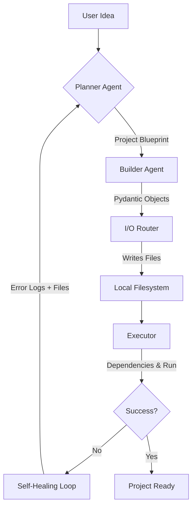

# AutoForge 🔨 
**The Autonomous AI Software Engineer that Plans, Builds, Runs, and Self-Heals.**

AutoForge is not just an LLM wrapper—it’s a fully autonomous development pipeline. Designed to take a high-level natural language prompt and transform it into a fully functional, production-ready codebase. It doesn't stop at generation; it executes the code, catches runtime errors, and iteratively fixes itself until the project is stable.

---

## ⚡ Core Philosophy: The Zero-Human Loop
Most AI code generators output raw text and leave the debugging to you. AutoForge closes the loop:
1. **Architect:** Plan the project structure and tech stack.
2. **Build:** Generate fully implemented source files.
3. **Execute:** Run the project in a sandboxed environment.
4. **Self-Heal:** Capture tracebacks and refine logic automatically.

---

## 🏗️ Architecture: How It Works



### 🧠 The Agents
*   **Planner (LangChain + Gemini 2.5):** Translates ideas into structured JSON blueprints.
*   **Builder (Pydantic + Gemini 2.5):** Generates precise, production-quality code.
*   **Executor:** Manages virtual environments, installs dependencies, and monitors runtime.
*   **Fixer:** The "brain" that analyzes stack traces and applies targeted patches.

---

## �️ Tech Stack
*   **Core:** Python 
*   **Intelligence:** Google Gemini 2.5 Flash
*   **Orchestration:** LangChain (Core, Google GenAI, Community)
*   **Data Integrity:** Pydantic (Structured Outputs)
*   **Environment:** Dotenv, Docker SDK
*   **Formatting:** Black (Python), Prettier (Web)

---

## 🚀 Getting Started

### Prerequisites
1.  **Python**
2.  **Google Gemini API Key** (Set as `GOOGLE_API_KEY` in `.env`)
3.  **Docker Desktop** (Optional, for upcoming sandboxed execution)

### Installation
```bash
# Clone the repository
git clone https://github.com/Rishabh23112/AutoForge.git
cd AutoForge

# Create and activate virtual environment
python -m venv venv
source venv/bin/activate  # Windows: venv\\Scripts\\activate

# Install dependencies
pip install -r requirements.txt
```

### Usage
Run the main entry point and enter your project idea:
```bash
python main.py
```
*Example input: "Create a real-time weather dashboard using React and a public weather API."*

---

## 🔮 Roadmap
- [x] Multi-file Generation Engine
- [x] Pydantic-based Structured I/O
- [x] Basic Auto-Fix Loop
- [ ] Docker Integration (Phase 3)
- [ ] Real-time Streaming UI (FastAPI + SSE)
- [ ] Git Integration (Auto-commits on fix)

---


