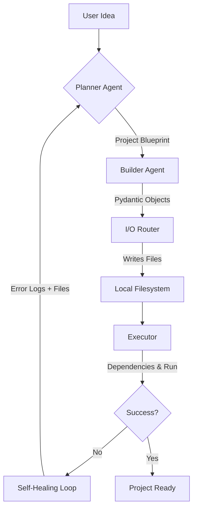

# AutoForge 🔨 
**The Autonomous AI Software Engineer that Plans, Builds, Runs, and Self-Heals.**

AutoForge is not just an LLM wrapper—it’s a fully autonomous development pipeline. Designed to take a high-level natural language prompt and transform it into a fully functional, production-ready codebase. It doesn't stop at generation; it executes the code, catches runtime errors, and iteratively fixes itself until the project is stable.

---

## ⚡ Core Philosophy: The Zero-Human Loop
Most AI code generators output raw text and leave the debugging to you. AutoForge closes the loop:
1. **Architect:** Plan the project structure and tech stack.
2. **Build:** Generate fully implemented source files.
3. **Execute:** Run the project in a sandboxed environment.
4. **Self-Heal:** Capture tracebacks and refine logic automatically.

---

## 🚩 Problem: The "Broken" AI Workflow
Current AI coding tools (LLMs) often generate code in isolation. The developer is left to:
1. Manually create files and copy-paste code.
2. Debug environment-specific dependency issues.
3. Waste time fixing syntax errors or logical gaps in generated snippets.
4. **Manually test the generated outputs** to verify correctness and safety.

AutoForge addresses this "disconnected code" problem by bridging the gap between generation and execution. 

> [!TIP]
> **Future Roadmap:** I am working on an automated evaluation engine that will test generated code against predefined benchmarks and evaluation criteria, removing the manual verification step entirely.

---

## 🛠️ Approach: The Self-Healing Pipeline
AutoForge implements a **Closed-Loop Development Architecture**:
- **Structured Planning:** Instead of raw text, I use Pydantic schemas to ensure the AI's blueprint is always valid JSON.
- **Recursive Refinement:** If the code fails during execution, the error logs are fed back into the "Fixer Agent," which applies patches until the project is stable.
- **Environment Autonomy:** The system automatically detects the language (Python/Node.js) and manages dependency installation (`pip` or `npm`).

---

## 🔄 Iterations: The Evolution of AutoForge
- **Phase 1: Single-File Generation:** Initial proof-of-concept focused on creating individual Python scripts.
- **Phase 2: Multi-File Pydantic Engine:** Transitioned to structured outputs to allow complex, inter-dependent project generation.
- **Phase 3: The Execution Loop:** Integrated the `subprocess` runner and automated dependency management.
- **Phase 4 (Current): Auto-Fix Logic:** Added the self-healing loop that analyzes stack traces to recursively improve code quality.

---

## 🏗️ Architecture: How It Works



### 🧠 The Agents
*   **Planner (LangChain + Gemini 2.5):** Translates ideas into structured JSON blueprints.
*   **Builder (Pydantic + Gemini 2.5):** Generates precise, production-quality code.
*   **Executor:** Manages virtual environments, installs dependencies, and monitors runtime.
*   **Fixer:** The "brain" that analyzes stack traces and applies targeted patches.

---

## 💡 Key Design Choices
- **Gemini 2.5 Flash:** Chosen for its superior reasoning capabilities and speed in generating complex multi-file structures.
- **Pydantic for Schema Enforcement:** Prevents the "JSON parsing nightmare" common in LLM workflows by strictly validating outputs before writing to disk.
- **Recursive Self-Healing:** Implementing a `max_iterations = 5` loop ensures the AI doesn't get stuck in infinite loops while providing enough attempts to fix complex bugs.
- **Path/Content Alias Support:** Uses `AliasChoices` in Pydantic models to handle diverse LLM naming conventions for file outputs.

---

## ⏱️ Daily Time Commitment
- **Development Time:** ~4 hours per day.
- **Breakdown:** 40% Architecture/Planning, 40% Logic Implementation, 20% Prompt Engineering & Tuning.

---

## ️ Tech Stack
*   **Core:** Python 
*   **Intelligence:** Google Gemini 2.5 Flash
*   **Orchestration:** LangChain (Core, Google GenAI, Community)
*   **Data Integrity:** Pydantic (Structured Outputs)
*   **Environment:** Dotenv, Docker SDK
*   **Formatting:** Black (Python), Prettier (Web)

---

## 🚀 Getting Started

### Prerequisites
1.  **Python**
2.  **Google Gemini API Key** (Set as `GOOGLE_API_KEY` in `.env`)
3.  **Docker Desktop** (Optional, for upcoming sandboxed execution)

### Installation
```bash
# Clone the repository
git clone https://github.com/Rishabh23112/AutoForge.git
cd AutoForge

# Create and activate virtual environment
python -m venv venv
source venv/bin/activate  # Windows: venv\\Scripts\\activate

# Install dependencies
pip install -r requirements.txt
```

### Usage
Run the main entry point and enter your project idea:
```bash
python main.py
```
*Example input: "Create a real-time weather dashboard using React and a public weather API."*

---

## 🔮 Roadmap
- [1] Multi-file Generation Engine
- [2] Pydantic-based Structured I/O
- [3] Basic Auto-Fix Loop
- [4] Docker Integration 
- [5] Real-time Streaming UI (FastAPI + SSE)
- [6] Git Integration (Auto-commits on fix)

---


